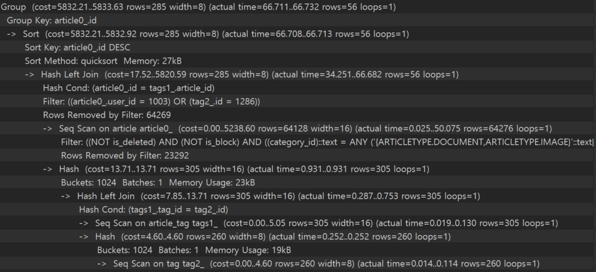
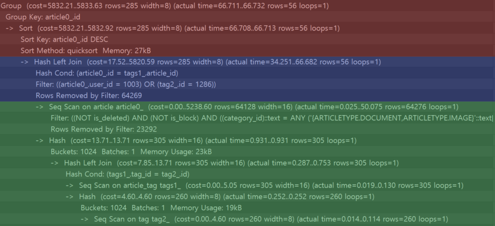
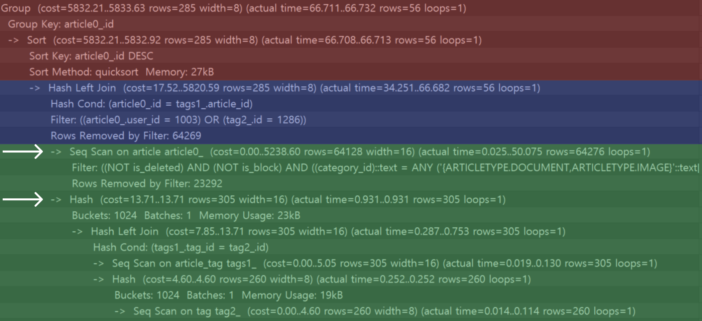
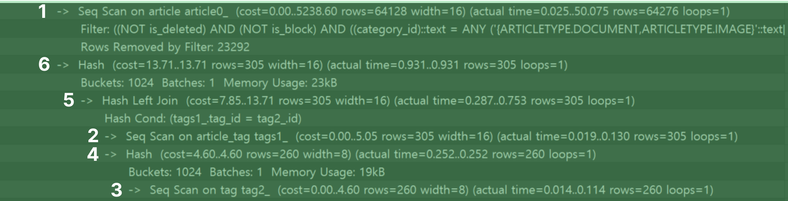
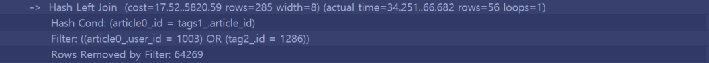
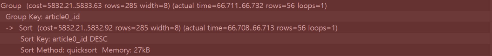
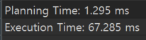
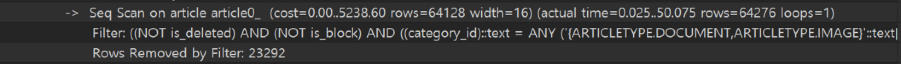
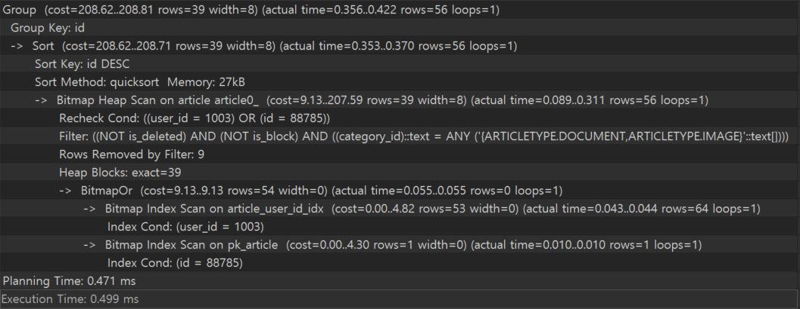

[네이버](https://naver.com)에서 가장 많이 방문하는 주소는 뭘까요? 

[보통 https://naver.com 으로 접속하는 경우가 가장 많습니다.](https://www.similarweb.com/website/naver.com/) 그렇기 때문에 메인 페이지 접속 시 호출되는 API가 느리다면 사용자 경험에 큰 영향을 줄 수밖에 없습니다.

실무에서 개발한 서비스도 메인 페이지에서 여러 API를 호출하고 있었고, 단순 캐싱 수준을 넘어 쿼리 플랜에 대한 분석을 통해 개선한 경험을 소개드리려고 합니다. 

## 피드 API 개선
---
성능을 실질적으로 개선하기 전에 문제의 원인을 분석해볼 수 있는 방법 중 하나가 데이터베이스로 전달되는 쿼리를 분석하는 것 입니다. 데이터베이스로 전달된 쿼리가 옵티마이저에 의해 어떤 실행 계획을 가지고 데이터를 찾았는지 알게 된다면 쿼리 개선에 도움이 될 수 있습니다. 

*(쿼리를 보기 좋게 다듬은 결과이며, Spring Boot 기준 Hibernate 에 의해 생성된 쿼리가 전송되기 때문에 아래 쿼리 플랜과 비교하여 Alias 와 같은 차이점은 있으나, 구조는 동일합니다.)*

```sql
SELECT a.id
FROM article a
	LEFT OUTER JOIN article_tag tag1 ON a.id = tag1.article_id
	LEFT OUTER JOIN article_tag tag2 ON tag1.tag_id = tag2.id
WHERE ( a.user_id = ? OR tag2.id = ? )
	AND ( a.category_id IN ( ?, ?) )
	AND a.is_deleted = ?
	AND a.is_block = ?
GROUP BY a.id
ORDER BY a.id DESC
```

위 쿼리는 병목이 발생한다고 여겨지는 쿼리입니다. 해당 쿼리를 분석하기 위해 `PostgreSQL` 기준 `EXPLAIN ANALYZE` 구문을 추가해주도록 합니다.

```sql
EXPLAIN ANALYZE
SELECT a.id
FROM article a
	LEFT OUTER JOIN article_tag tag1 ON a.id = tag1.article_id
	LEFT OUTER JOIN article_tag tag2 ON tag1.tag_id = tag2.id
WHERE ( a.user_id = ? OR tag2.id = ? )
	AND ( a.category_id IN ( ?, ?) )
	AND a.is_deleted = ?
	AND a.is_block = ?
GROUP BY a.id
ORDER BY a.id DESC
```




처음 본다면 다소 당황스러울 수 있습니다. 그래서 가장 먼저 읽는 순서를 알아야 합니다. 그래야 어떤 방식으로 데이터를 조회하는지에 대한 쿼리 실헹 계획을 알아갈 수 있습니다. 실행 계획이 조금 길기 때문에 여러 구역으로 분리해서 알아보도록 합니다.



### 초록색 구역
---
가장 먼저 `초록색 구간`에 대해 알아보는 이유는 보통 위에서 아래로 절차적으로 실행되는 것이라고 생각할 수 있겠지만 쿼리 플랜은 그렇지 않습니다. 각각의 작업들은 일련의 계층 구조를 가지며 부분적으로 절차적으로 진행됩니다. 

그 말은 즉, 어떠한 계층이 여러 하위 계층들을 가진다면 그 하위 계층들은 순차적으로 실행된다는 의미입니다. 각각의 계층은 화살표 (→) 로 구분되는데, `파란색 계층` 아래에는 2개의 계층이 존재합니다.



 `Seq Scan on article article0_` 로 시작하는 작업은 첫 번째 하위 계층이기 때문에 가장 먼저 실행됩니다. 
 작업이 끝나면 다음 하위 계층인 `Seq Scan on article_tag tags1_` 작업이 실행됩니다.

이제 번호를 통해 어떤 순서로 시작하는 지 감을 잡아보도록 하겠습니다.



1. `Filter` 를 보면 조건절이 있습니다. Article 테이블을 `Seq Scan (Full Scan)` 하여 해당 조건에 적합한 `article` 데이터를 조회합니다.
2. `LEFT JOIN` 을 위해 article_tag 테이블의 데이터를 스캔합니다.
3. `LEFT JOIN` 을 위해 tag 테이블의 데이터를 스캔합니다.
4. `JOIN` 을 위해 `Hash Table` 을 생성합니다.
5. `article_tag` 테이블과 `tag` 테이블을 조인합니다.
6. `JOIN` 을 하기 위한 `Hash Table` 을 생성합니다.

### 파란색 구역
---



이제까지 기본적인 조건과 적합한 `article` 데이터를 조회했고, `article_tag` 테이블과 `tag` 테이블을 `JOIN` 한 `Hash Table` 을 생성했습니다. 그리고 `파란색 구역` 은 JOIN을 하게 되는 구간입니다.

그 과정에서 
`article.user_id = ? OR tag.id = ?` 
조건절을 만족하는 레코드를 필터링 하게 됩니다. 이 과정을 `파란색 구역`에서 수행하게 됩니다.

### 빨간색 구간
---



빨간색 구간은 그 이후에 있는 `ORDER BY`, `GROUP BY` 를 수행하게 됩니다. 

### 성능 추적
---
이제까지 유저 피드 조회 시에 실행되는 쿼리에 대해 분석해봤습니다. 이제 쿼리를 실행하게 되면 실제로 어떤 순서와 방법으로 데이터를 조회하는지 간략하게나마 알게되었고, 마지막에는 현재 테이블의 데이터를 기준으로 실행되는 쿼리의 시간을 알 수 있습니다. 



다만 우리가 궁금한 건 어떤 순서로 작업을 진행하는지가 아닙니다. 최종적으로 생성된 쿼리가 얼마나 효율적으로 높은 성능으로 데이터를 조회해오는지이고, 그렇지 못한다면 어떤 곳에서 성능적으로 유실이 많은 지 알아내는 것 입니다. 

다행히 쿼리 플랜에서 쉽게 병목 구간을 알아낼 수 있습니다. 쿼리 플랜을 보다 보면 `cost` 라는 것이 있다는 것을 알 수 있습니다. 이는 절대적 지표가 아닌, 해당 작업을 수행하는데 상대적인 비용이 얼만큼 들었느냐에 대한 지표입니다. 

그럼 가장 `cost` 가 높게 측정되는 구간은 어디일까요?



해당 작업이 다른 작업들과 `cost` 를 비교했을 때, 가장 높은 `cost` 를 나타내고 있음을 알 수 있습니다. 또한 `cost` 정보 외에도, `actrual time`, `rows` 와 같은 간접적 지표를 통해 작업의 성능을 추측할 수 있습니다.

위 작업에 대해 설명하자면, 기본적인 조건절을 통해 article 데이터를 조회한 결과, 64276개 달하는 데이터를 조회했습니다. 이는 `Seq Scan (Full Scan)` 이기 때문에 Index 를 타지 않고, 조회해온다는 것을 알 수 있습니다.

- `category_id IN ( ?, ? )`
- `is_deleted = false`
- `is_blocked = false`

정리하자면 위 조건들이 적용된 쿼리가 Article 테이블을 풀 스캔하여 64276개의 데이터를 조회하게 됩니다. 
그리고 원래 쿼리의 조건절을 다시 보게 되면 위 조건절은 제외하고도 한 가지의 조건절이 더 포함되어 있습니다.

- `( a.user_id = ? OR t.id = ? )`

위 두 조건 모두 피드를 구분 짓는 중요한 조건들입니다. 전자는 `팔로우 한 크리에이터들의 article`을 구분지을 때 사용하는 조건절이고, 후자는 사용자가 등록한 `관심 태그 ID` 가 들어가는 조건입니다. 그리고 이 둘을 모두 포함하도록 `OR 연산자` 가 붙었습니다.

즉 `t.id = ?` 이 구간 때문에 `a.user_id` 로 인덱스를 타려고 하지만 `OR 연산자` 때문에 `t.id = ?` 도 포함하는 Article도 가져와야 하기 때문에 인덱스를 타지 못하고, `Table Full Scan` 을 하게 되어 병목이 발생하게 됩니다.

지금은 `article` 테이블의 전체 데이터 수가 6만여건 밖에 되자 않아, 별로 크게 성능을 저하시키지 않는 것처럼 보이지만, 데이터가 많아지게 되면 치명적입니다.
>**각각 `category_id` , `is_deleted`, `is_blocked`  인덱스를 생성하면 되지 않을까?**
>
> 하지만 해당 인덱스를 생성해도 결과는 똑같습니다. (복합 인덱스라면 이야기가 다를 수 있다.) `PostgreSQL` 은 조회하는 데이터가 해당 테이블의 많은 부분을 차지하면, Index가 아닌 Full-Scan을 통해 데이터를 조회합니다. (카디널리티가 낮으면 인덱스 효과가 떨어지기 때문에)

그럼 쿼리 플랜을 통해 병목 구간을 확인했으니, 개선 방법을 알아봅시다.

### 쿼리 개선
---
위 쿼리를 실행하면 약 `67ms` 의  시간이 소요되었습니다. 전혀 길지 않은 실행시간이지만, 더 단축시키게 되면 많은 요청이 몰렸을 때나 데이터가 많아졌을 때, 하나의 트랜잭션 자체에 Connection을 물고 있는 시간을 개선 할 수 있습니다.

아직 효율적인 쿼리 작성에 미숙하기에, 가장 빨리 데이터를 조회할 수 있는 방법을 선택했습니다.

우선 해당 쿼리를 인덱스를 타는 방향으로 개선하는게 좋아보였습니다. 현재 쿼리는 너무나 많은 `article` 을 조회하기 때문에 적절한 개수의 `article` 을 조회하도록 개선이 필요했습니다. 즉 `user_id` 에 대한 **인덱스**를 타게끔 유도해야 합니다.

**그래서 쿼리를 분리하기로 결정했습니다.**

`article_tag` 와 `tag` 테이블을 조인하지 않고, `user_id` 처럼 유저가 가지고 있는 관심 태그를 기반한 `article` 의 `id` 를 인자로 받아서 다음과 같은 쿼리로 개선하기로 하였습니다.

```sql
SELECT a.id
FROM   article a
WHERE  ( a.user_id = ? OR a.id = ? )
       AND ( a.category_id IN ( ?, ? ) )
       AND a.is_deleted = ?
       AND a.is_block = ?
GROUP  BY a.id
ORDER  BY a.id DESC
```

쿼리가 훨씬 간단해졌습니다. 이런식으로 쿼리를 튜닝하게 되면 `user_id` 와 `id` 가 Index를 타게 되어, 전보다 훨씬 빠른 속도로 데이터를 조회하게 되어, 성능이 향상됩니다. 이 결과 역시 쿼리 플랜을 통해 확인할 수 있습니다.



OR 연선자에 해당하는 데이터들은 모두 `Index Scan`을 통해 조회했고, 그 후에 기본 조건들을 적용했습니다.

최종적으로 **`기존 67ms` 쿼리 실행 시간에서 0.5ms 로 134배 향상되었음을 확인할 수 있습니다.**

하지만 JOIN을 통해 태그 정보를 가져오는 것이아닌, 인자로 유저의 관심 태그를 보유한 `article.id` 목록을 가져오는 것이기 때문에 발생하는 쿼리가 늘어난다는 단점이 존재합니다. 

그럼에도 불구하고 조인을 제거하고, 단일 테이블 조건으로 바꾼 덕분에 쿼리의 속도, 인덱스 효율, 캐시 적중률이 압도적으로 좋아졌고 총 쿼리의 수가 N+1 문제와 같이 치명적인 수준의 쿼리의 개수가 늘어난 것임이 아니기 때문에 적절한 개선 방법이라고 생각합니다.

### 마무리
---
결과적으로 의미있는 성능 개선의 경험을 할 수 있었습니다. 위 방법처럼 쿼리 플랜을 통해 쿼리를 분석한다면 성능 개선에 더욱 더 도움이 될 수 있습니다. 하지만 저런식으로 나오는 쿼리 플랜의 결과물은 다소 가독성이 떨어집니다. 그래서 이를 보기 좋게 시각화 해주는 툴을 소개해주도록 하겠습니다.

먼저 분석하고자 하는 쿼리에 다음과 같은 키워드를 추가합니다

```sql
# 기존
EXPLAIN ANALYZE
...SQL

# 변경
EXPLAIN (ANALYZE, COSTS, VERBOSE, BUFFERS, FORMAT, JSON)
...SQL
```

해당 쿼리의 결과물을 https://explain.dalibo.com/ 의 Plan 부분에 붙여넣고 전송하게 되면 쿼리 플랜을 시각화하여 볼 수 있습니다.