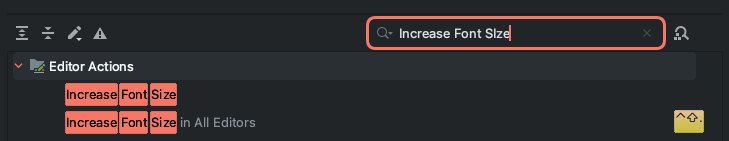

어느 날, 마우스 휠 Up, Down을 통해 IntelliJ Editor의 Font Size 조절이 갑자기 되지 않았다.

`IntelliJ IDEA -> Settings -> Editor -> General -> Change font size in Command + Mouse Wheel in` 옵션을 건드려봐도, Mac 자체에서 지원하는 Zoom이 될 뿐, Editor의 Font Size가 변경되지는 않았다.
## 해결방법
### 1. 손쉬운 사용 설정 켜져있는지 확인
나의 경우 `손쉬운 사용 -> 확대/축소` 에서 `스크롤 제스처를 위한 보조 키` 에 `Command(⌘)`가 매핑되어 있었다.

이러한 경우 `스크롤 제스처를 위한 보조 키` 옵션을 다른 키로 설정하여 주고, IntelliJ의 `IntelliJ IDEA -> Settings -> Editor -> General -> Change font size in Command + Mouse Wheel in` 옵션이 켜져있으면 정상적으로 마우스 휠을 통해 Font Size 조절이 가능하다.

### 2. Keymap
`스크롤 제스처를 위한 보조 키` 옵션을 변경하지 않고 해결하는 방법은 바로 IntelliJ의 `Keymap`을 활용하는 것이다. 

1. `IntelliJ IDEA` -> `Settings` -> `Keymap`
2. `Increase Font Size` 검색  
  a. `Add ... Shortcut` 선택 후 단축키 입력
3. `Decrease Font Size` 검색  
  a. `Add ... Shortcut` 선택 후 단축키 입력

해당 설정은 `스크롤 제스처를 위한 보조 키` 옵션에 `Command(⌘)`가 설정되어 있고, 바꾸고 싶지 않을 때 사용할 수 있는 설정이다. 단축키 설정 시, `Command(⌘)`가 들어가지 않게 설정하여야 유효하게 사용할 수 있다.