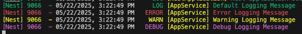
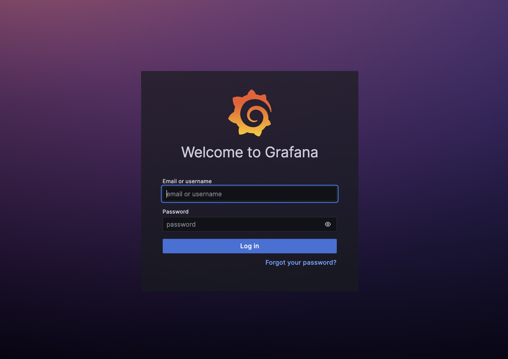
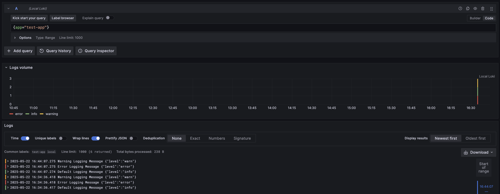

# NestJS 환경에서 로그 시스템을 구축하는 방법

### 기본 Logger 사용하기

---

NestJS는 `@nestjs/common` 에서 제공하는 Logger 클래스를 기본 제공한다.

```tsx
import { Injectable, Logger } from '@nestjs/common';

@Injectable()
export class AppService {

	logger = new Logger(AppService.name);

	defaultLogging(): string {
		this.logger.log("Default Logging Message");
		this.logger.error("Error Logging Message");
		this.logger.warn("Warning Logging Message");
		this.logger.debug("Debug Logging Message");
		return "Successfully logged messages";
	}
	
}
```

기본적으로 지원하는 Logger의 Console 출력 결과는 다음과 같다.



### Winston

---

Winston은 Node.js 환경에서 동작하는 Logging 라이브러리이다. 구조화 된 Logging과 유연한 로그 설정을 위한 범용 라이브러리이다. Winston을 통해 로그를 기록하고 출력하며 추후 확장까지 고려할 수 있다.

```bash
npm install winston
npm install -D @types/winston     
```

```tsx
/* app.logger.ts */

import { createLogger, format, transports } from "winston";

const logger = createLogger({
	level: 'info',
	format: format.combine(
		format.timestamp(),
		format.printf(({ level, message, timestamp }) => {
			return `[${timestamp}] ${level.toUpperCase()}: ${message}`;
		}),
	),
	transports: [
		new transports.Console(),
		new transports.File({ filename: 'logs/combined.log' }),
    new transports.File({ filename: 'logs/error.log', level: 'error'}),
	]
})

export default logger;
```

- **`format`**
    
     로그를 어떻게 만들지 설정합니다.  `format.simple()`, `format.json()`, `format.timestamp()`, `format.printf()` 등 다양한 방법으로 설정이 가능합니니다. 
    
- **`transports`**
    
    Console, File, Http, Stream 등 로그를 콘솔, 파일, 네트워크 등 출력 대상으로 보내주는 역할을 합니다. 
    

```tsx
/* winston-logging.service.ts */

import logger from "./app.logger";

doLogging(): string {
    logger.info("Default Logging Message");
    logger.error("Error Logging Message");
    logger.warn("Warning Logging Message");
    logger.debug("Debug Logging Message");

    return "Successfully winston logged messages";
}
```

# Loki와 Winston 연동하기

Winston은 `transports` 옵션을 통해 다양한 곳으로 로그를 출력하거나 전송할 수 있다.. 대표적으로 Grafana 진영에서 로그를 수집하는 `Loki` 라는 오픈소스가 있다. Winston Logging 라이브러리를 사용하는 NestJS 서버에서 Loki와 연동하여 로그를 보낼 수 있다.

## 설치

Loki와 연결하고자 하는 환경에 `winston-loki` 의존성을 설치하고, Docker롤 통해 로컬 환경에서 Loki를 띄운다. 마지막으로 Grafana를 통해 Loki에 의해 수집된 로그를 시각화하여 확인하는 것으로 본 포스팅을 마친다.

**winston-loki 의존성 설치**

```bash
npm install winston-loki
```

`winston-loki` 의존성 설치 후에 이전 **Winston Logger 환경 설정**을 다시 해주어야 한다. 크게 변하는 것은 없고, Loki Connection과 Label(라벨) 그리고 기타 옵션들을 설정해주면 된다.

<aside>

Label이란? (Loki에 대해 설명하는 포스트는 아니니, 간략히 설명하고 넘어간다. )

`key=value` 형태의 메타 데이터로, Loki에서 Log를 구분하고 필터링하는 개념이다. 하나의 로그는 반드시 Label을 갖고 있어야 하며, 같은 Label을 가진 로그들은 하나의 로그 스트림으로 분류된다.

</aside>

```tsx
import { createLogger, format } from "winston";
import LokiTransport from "winston-loki";

const logger = createLogger({
    level: 'info',
    format: format.combine(
        format.timestamp(),
        format.json()
    ),
    transports: [
        new LokiTransport({
            host: 'http://localhost:3100',
            labels: { app: 'test-app', env: 'local' },
            json: true,
            replaceTimestamp: true,
        }),
    ],
});

export default logger;
```

위와 같이 설정을 완료하고 나면, 이전에 사용했던 winston-logging.service.ts의 doLogging() 함수를 통해 로그를 남기도록 한다.

## Loki 구성

---

다음은 Loki를 설치 할 차례이다. Loki에 대해 설명하는 글을 아니니 자세한 내용은 [Loki 공식 홈페이지](https://grafana.com/oss/loki/)에서 확인할 수 있다. 간단하게 연동되는 것만을 확인하기 위해서 Docker를 이용해서 Local 환경에서 설치한다.

```bash
docker run -d --name={CONTAINER_NAME} -p {PORT}:{PORT} grafana/loki:{VERSION} -config.file=/etc/loki/local-config.yaml
```

`/loki/api/v1/query`  라는 API 엔드포인트를 통해 Loki에 접근할 수 있다.  다음 명령어를 통해 Loki로 로그가 잘 전송 됐는지 확인한다.

```bash
curl -G -s "http://localhost:3100/loki/api/v1/query" --data-urlencode 'query={app="test-app"}'
```

성공적으로 전송되었다면, 이를 시각화하여 편하게 로그를 모니터링 할 수 있는 시스템이 있으면 좋을 것 같다. 다행히도 이를 강력하게 지원하는 **`Grafana`** 라는 툴이 있다. 

## Grafana로 Loki에 수집된 로그 시각화

---

Grafana는 시계열 데이터를 시각화하는 오픈소스 대시보드다. Prometheus, Loki 등 다양한 Datasource 등을 연결하여, 시계열 데이터를 시각화 할 수 있다. Loki와 같은 로그 수집기와 연동을 하면 실시간 로그 조회와 검색이 가능하며 `Metric` 과 함꼐 분석 할 수 있다.

Grafana에 대한 자세한 내용은 [Grafana 공식 홈페이지](https://grafana.com/docs/grafana/latest/)를 참조하자.

### **설치**

Grafana는 Loki와 마찬가지로 Docker 환경에서 빠르게 시작할 수 있다. 각 사용자 환경에 맞는 옵션을 추가하여 설치하도록 한다.

```bash
docker run --name={CONTAINER_NAME} -p {PORT}:{PORT} \
-e GF_SECURITY_ADMIN_USER={ADMIN_USERNAME} \
-e GF_SECURITY_ADMIN_PASSWORD={ADMIN_PASSWORD} \
grafana:grafana:{version}
```

컨테이너가 뜨고 나면, `http://{host}:{GRAFANA_CONTAINER_PORT}` 를 통해 접근할 수 있다. 



접속하게 되면 위와 같은 화면이 나타날텐데, Grafana를 설치할 때 `docker run` 명령어에 환경변수로 입력했던 `GF_SECURITY_ADMIN_USER`, `GF_SECURITY_ADMIN_PASSWORD` 의 value 값을 넣어 관리자 로그인 가능하다.

### DataSource 추가

### Grafana에서 눈으로 로그 확인하기

