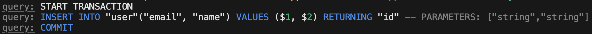

[이전 글 (NestJS 트랜잭션 적용 원리 알아보기)]() 에서는 NestJS와 Node.js 환경에서 TypeORM을 통해 어떤식으로 `Transaction` 을 적용할 수 있는지 실제 `TypeORM` 코드와 함께 살펴봤다.

본 포스트에서는 [typeorm-transactional](https://www.npmjs.com/package/typeorm-transactional)을 사용하지 않고, 직접 `@Transactional` Decorator를 구현하여 간편하게 트랜잭션을 적용하는 법을 보이겠다.


## Node.js의 Thread Local Storage

Thread Local Storage는 쉽게 말해서 각 Thread 마다 따로 저장되는 값이다. 멀티 스레드 환경에서 데이터 충돌을 방지하는 목적으로 사용하는 데 유용하다. 

```java
/* Java에서 ThreadLocalStorage를 생성하고 사용하기 */
ThreadLocal<String> threadLocal = new ThreadLocal<>();

threadLocal.set("A");
String value = threadLocal.get(); // return "A"
```

다른 스레드에서는 `threadLocal` 변수에 저장된 `"A"` 라는 값을 조회할 수 없다.

`Spring Boot`는 `멀티 스레드` 환경이기에 `ThreadPool` 에서 요청 하나 당 1개의 Thread를 할당 받아 처리하기 때문에 `ThreadLocal` 클래스를 통해 `ThreadLocalStorage` 를 사용할 수 있다.

하지만 `Node.js` 환경은 `싱글 스레드 기반` 으로 동작하기 때문에 요청별 컨텍스트를 분리할 수 없어 기본적으로 Thread Local Storage를 만들 수 없다.

### cls-hooked
[cls-hooked](https://www.npmjs.com/package/cls-hooked) 는 `Node.js` 에서 `ThreadLocal` 처럼 동작하는 `Continuation-Local-Storage` 를 만들기 위해 나온 모듈이다. 이는 내부 `Namespace` 를 하나 생성하여, 내부적으로 `Map<asyncId, Context>` 구조로 저장소를 갖는다. 

하지만 마지막 업데이트가 너무 오래전이고, 비공식 구현체이다.


### Async Local Storage
`async_hooks` 기반으로 동작되는 공식 `Node.js` 의 `Async Local Storage` 이다. 

> **async_hooks 란?**
> `async_hooks` 는 `Node.js` 에서 제공하는 비동기 콜백의 생명주기를 추적할 수 있는 API 이다. 싱글 스레드 기반인 Node.js 에서는 비동기 함수들의 흐름이 섞일 경우, 이를 추적하기 어렵다. 이를 쉽게하기 위해서 구현된 것이 `async_hooks` 이다.
> 다만 이 `async_hook` 는 사용이 금지시 되고 있다. 비동기 컨텍스트 추적 용도로는 `AsyncLocalStorage` 를 사용하도록 권고되고 있다. [참고](https://nodejs.org/api/async_hooks.html?utm_source=chatgpt.com#async-hooks)

`AsyncLocalStorage` 는 비동기 컨텍스트 유지가 가능하고, Node.js 에서 공식적으로 지원하는 비동기 컨텍스트 추적 객체이다. 다음과 같이 사용할 수 있다.

```ts
/* async-context.ts */
import { AsyncLocalStorage } from 'node:async_hooks';

const asyncLocalStorage = new AsyncLocalStorage<string>();

export const context = {
  run: (value: string, callback: () => void) => {
    asyncLocalStorage.run(value, callback);
  },
  get: (): string | undefined => {
    return asyncLocalStorage.getStore();
  },
};
```

```ts
/* runner.ts */
import { context } from './async-context';

context.run('hello jin-daram', () => {
  setTimeout(() => {
    console.log(context.get());
  }, 100);
});
```

`Node.js` 기반 서버와 응용하여 사용하면 `Spring Boot` 의 `ThreadLocal` 처럼 활용할 수 있다.

 
## @Transactional

위에서, 알게 된 내용을 바탕으로 `@Transactional` Decorator를 생성하여 본다. 먼저 트랜잭션이 필요한 `Post` 요청을 처리하는 `Service`를 생성하도록 한다.

```ts
@Injectable()
export class UserService {

  async createUser(userCreateRequest: UserCreateRequest): Promise<void> {
    await this.userRepository.save(userCreateRequest);
  }

}
```

요청 정보로 `User` 를 생성하는 매우 간단한 코드이다. 지금은 `UserRepository` 생성 시 선언된 `EntityManager`를 통해 트랜잭션을 유지하기 때문에 `createUser()` 함수에 다른 엔티티에 대한 `INSERT`, `UPDATE`, `DELETE` 쿼리가 추가된다면 트랜잭션이 유지될 수 없는 상황이다.

이제 `createUser()` 함수가 실행되기 전에 `em.transaction()` 콜백 함수의 인자로 들어오는 manager를 해당 요청 내에서 사용해야한다. 즉 `UserRepository` 에서 접근하는 `EntityManager` 가 변경되어야 하고, 이 접근 방식을 다르게 설정해야 한다. 

이는 `typeorm-transactional` 에서 구현했던 방식과 비슷하게 `Object.defineProperty(...)` 함수를 이용해서 설정한다.

```ts
/* init.ts */
export function init() {
    Object.defineProperty(Repository.prototype, 'manager', {
        configurable: true,
        get() {
            return context.get('entityManager')
        },
        set() {

        }
    })
}
```

우리는 `CustomRepository` 를 만들 때, 반드시 `Repository<Entity extends ObjectLiteral>` 를 상속받아 사용한다. `Repository`의 `prototype`의 `manager` 라는 속성에 접근할 때, `Repository.manager` 에 접근하는 것이 아닌, 우리가 나중에 생성할 `Request Context` 에서 접근하도록 설정한다.

```ts
/* user.repository.ts */
export class UserRepository extends Repository<User> {
  ...
}
```

그리고 해당 함수를 `main.ts` 에서 App이 실행되기 전에 싫맹한다.
```ts
/* main.ts */

init()
...
bootstrap();

```

### Context 만들기
`cls-hooked` 는 오래 전에 업데이트 되었기 때문에 상대적으로 최근에 생기고, `Node.js` 에서 지원하는 `Async-Local-Storage` 를 전격 활용하여 개발하도록 한다.

```ts
/* context.ts */
export class Context {

    private dataSource: DataSource;
    private readonly asyncLocalStorage = new AsyncLocalStorage<Map<string,EntityManager>>();

    public getDataSource() {
        return this.dataSource;
    }

    public async setDataSource(targetDataSource: DataSource) {
        await targetDataSource.initialize();
        this.dataSource = targetDataSource;
    }

    public run(store: Map<string, any>, callback: () => Promise<any>) {
        return this.asyncLocalStorage.run(store, callback);
    }

    public get(key: string) {
        return this.asyncLocalStorage.getStore()?.get(key);
    }

}
```

먼저 간단한 `Context` 클래스를 생성한다. 내부에는 `DataSource` 와 `AsyncLocalStorage` 로 이루어져 있다.
 
DataSource는 `@Transactional` Decorator 에서 트랜잭션를 생성하기 위해 저장한다. 그렇기 때문에 `main.ts`에서 해당 `Context` 에 `DataSource` Mapping이 필요하다.

```ts
context.setDataSource(new DataSource({
  type : "postgres",
  host : "localhost",
  port : 5433,
  username: "postgres",
  password : "mypassword",
  database: "postgres",
  entities: [User],
  logging: true,
}))

init()
...
bootstrap();
```

지금은 수동으로 `DataSource` 를 지정해주었지만, 향후 `TypeORM` 모듈을 통해 `Context` 에 자동으로 `DataSource` 를 설정하는 것도 가능할 것 같다.

### @Transactional Decorator 생성하기
```ts
export function Transactional(): MethodDecorator {
  return function (_target, _propertyKey, descriptor: PropertyDescriptor) {
    const original = descriptor.value;

    descriptor.value = async function (...args: any[]) {
      const dataSource = context.getDataSource();
      return await dataSource.manager.transaction(async (transactionManager) => {
        return await context.run(new Map([['entityManager', transactionManager]]), async () => {
          return await original.apply(this, args);
        });
      });
    };
  };
}
```

코드 구성은 간단하다. 전역적으로 접근할 수 있는 Context 로 부터, DataSource를 가져온다.

그런 후에 DataSource의 EntityManager의 transaction() 함수를 통해 콜백 함수의 인자로 주어진 EntityManager를 `Map<string, EntityManager>` 형태의 Store에 저장한다.

그리고 실행하고자 하는 함수를 실행한다.

### 적용하기

기존에 트랜잭션을 적용하고자 했던 함수에 `@Transactional` Decorator를 붙인다.

```ts
@Injectable()
export class UserService {

  @Transactional
  async createUser(userCreateRequest: UserCreateRequest): Promise<void> {
    await this.userRepository.save(userCreateRequest);
  }

}
```

이후 결과를 확인해보면 성공적으로 트랜잭션이 원하는 대로 적용되는 것을 확인할 수 있다.




자세한 코드는 [블로그 코드 Repository](https://github.com/jin-daram/tech-blog-code-lab) 에서 확인 할 수 있다.


### References

https://medium.com/%40sebcurland/the-power-of-async-hooks-in-node-js-8a2a84238acb
