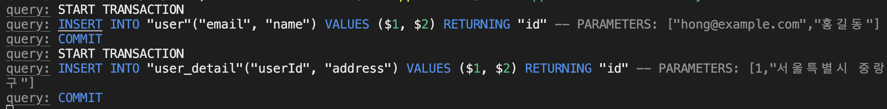
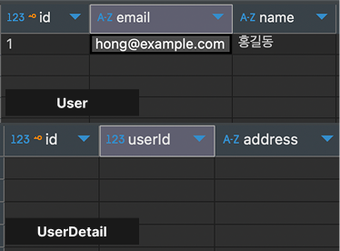
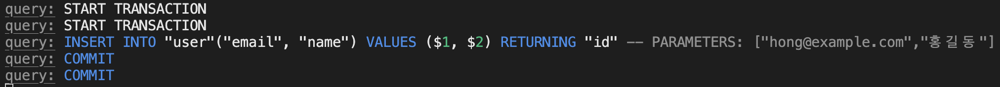

**Spring Boot** 에서는 다음과 같은 코드로 간단하게 `트랜잭션` 을 적용할 수 있다. 

```java
public class UserService {

    private final UserRepository userRepository;
    
    @Transactional // 트랜잭션 적용
    public void createUser(UserCreateRequest request) {
        User user = userRepository.save(new User(...));
    }
}
```

자세한 적용 원리나 옵션에 대해서는 `Spring Boot`의 [@Transactional](https://docs.spring.io/spring-framework/reference/data-access/transaction/declarative/annotations.html) Annotation에 대해 학습이 필용하지만, 위 방법으로 단순하고 간단하게 `트랜잭션`을 적용할 수 있다.

이것이 가능하게 하는 것이 바로 **AOP (Aspect-Oriented Programming, 관점 지향 프로그래밍, 이하 AOP)** 이다.

## AOP?
---
> AOP 설명을 목적으로 하는 포스트는 아니기 때문에 단순하게 설명함으로 양해 부탁드립니다. 자세한 이론적인 내용은 [위키백과 - AOP](https://ko.wikipedia.org/wiki/%EA%B4%80%EC%A0%90_%EC%A7%80%ED%96%A5_%ED%94%84%EB%A1%9C%EA%B7%B8%EB%9E%98%EB%B0%8D) 를 참고 하길 바랍니다.

쉽게 말하자면 `비즈니스 로직은  건들지 않고, 공통적으로 해야 하는 일을 앞, 뒤로 끼워넣는 프로그래밍 기법` 이다.
<br>

만약 프로젝트 내 모든 메소드의 실행 시간을 기록해야 한다면 어떨까?

```java
public void login() {
	long startTime = System.currentMillis();
	// 비즈니스 로직
	log endTime = System.currentMillis();
	System.out.println(endTime - startTime + "ms")
}
```

위 코드와 같은 포맷이 모든 메소드에 추가 되어야 할 것이다. 하지만 다음과 같이 구현한다면?

```java
@Measure
public void login() {
	// 비즈니스 로직
}
```

단순히 `@Measure` 을 붙이는 것만으로 해결할 수 있다면 우리는 비즈니스 로직 앞 뒤에 아무것도 붙이지 않고, 깨끗하게 비즈니스 로직에만 집중 할 수 있다. 사실 메소드 소요 시간 측정은 정말 가벼운 기능이 추가되는 것이지만, 더 복잡한 로직이 생기게 된다면, 비즈니스 로직보다 공통 로직이 더 많은 부분을 차지하는 기이한 현상이 벌어질 수 있다.

그렇기 때문에 Spring Boot 환경에서는 `@Transactional` Annotation을 통해 간단하게 `트랜잭션` 을 적용할 수 있는 방법을 제공한다.

## Node.js 환경에서의 트랜잭션
---
트랜잭션은 Node.js 환경에서도 물론 필요하다. 그렇기 때문에 적용할 수 있어야 한다. 하지만 관심을 가지지 않으면 단독적으로 트랜잭션이 적용될 수 있다.

```ts
@Injectable()
export class UserService {

	constructor(
		private readonly userRepository: UsreRepository,
		private readonly UserDetailRepository: UserDetailRepositoty
	)	{}

	createUser(request: UserCreateRequest) {
		const user = this.userRepository.save(request);
		const userDetail = this.userDetailRepository.save(request);
	}

}
```

우리의 기대와 달리, 트랜잭션이 `userRepository.save()` 와 `userDetailRepository.save()` 에 각각 적용된다.
어느 하나라도 실패가 된다면, 다른 쿼리도 `Rollback`  이 되어야 하지만, 실패해도 롤백이 이루어지지 않는다.



TypeORM 설정에서 `logging` 옵션을 `true` 로 두고 `데이터베이스 로그` 를 확인해보면 트랜잭션이 각각 분리되어 전송되는 것을 확인할 수 있다. 

만약 둘 중 하나가 실패한다면? 정상적으로 롤백이 이루어질까? 일부러 둘 중 하나의 로직이 실패하게 유도하고 결과를 지켜보자.



예상했던 결과처럼 `User` 테이블에는 데이터가 성공적으로 삽입되었고, 에러가 발생한 `UserDetail` 데이터는 삽입되지 않았다.

## 트랜잭션 적용하기
---
지금까지 트랜잭션이 정상적으로 적용되지 않는다는 것을 알 수 있었다. 이제 NestJS과 TypeORM에서 지원하는 트랜잭션 적용 방법을 알아보도록 하겠다.

```typescript
@Injectable()
export class UserService {
	constructor(private dataSource: DataSource) {}

	async createUser(request: UserCreateRequest) {
		const queryRunner = this.dataSource.createQueryRunner();
	
		await queryRunner.connect();
		await queryRunner.startTransaction(); // TRANSACTION START

		try {
			const user = queryRunner.manager.create(User, request);
			await queryRunner.manager.save(user); // User 저장
			
			const detail = queryRunner.manager.create(UserDetail, request);
			await queryRunner.manager.save(detail); // UserDetail 저장
			
			await queryRunner.commitTransaction(); // COMMIT
		} catch (err) {
			await queryRunner.rollbackTransaction();
      throw err;
		} finally {
			await queryRunner.release();
		}
		
	}
}
```

**심히 당황스럽다.**

핵심 로직은 엔티티를 생성하고, 저장하는 `4줄` 밖에 되지 않는다. 하지만 트랜잭션 로직 때문에 간단한 `createUser()` 함수가 거대해졌다. 혹시라도 함수의 내용이 방대해지거나, 분리가 필요하면 트랜잭션의 추적도 쉽지 않을 것이다.

> **DataSource를 의존성 주입을 받을 수 있는 이유**
>
> `@nestjs/typeorm` 의존성을 통해 `TypeOrmModule` 을 import 하면 내부에서 `DataSource` , `EntityManager` 등을 기본적으로 `Provider`로 추가한다. 
> <br> 실제 코드는 [@nestjs/typeorm typeorm-core-module.ts](https://github.com/nestjs/typeorm/blob/master/lib/typeorm-core.module.ts) 에서 확인할 수 있다.

그럼 다음과 같은 코드는 작동하지 않을까? 

```ts
@Injectable()
export class UserService {

    constructor(
        private readonly em: EntityManager,
        private readonly userRepository: UserRepository,
    ) {}

    async createUser(userCreateRequest: UserCreateRequest): Promise<void> {
        await this.em.transaction(async (manager) => {
            await this.userRepository.save(userCreateRequest);
        })
    }

}
```




결과는 기대했던 결과와는 달리 `트랜잭션`이 중첩되어 실행된다.

결론부터 말하자면, `UserService의 EntityManager` 와 `UserRepository의 EntityManager`가 서로 다른 참조를 하고 있다는 것이다.  

`UserService` 에 주입된 `EntityManager`의 `transaction`을 통해 생성된 `EntityManager` 와 `UserRepository` 에서 참조하는 `EntityManager` 는 같지 않다. 

이는 [TypeORM 공식 Github]() 코드를 통해 확인 할 수 있다.

```ts
/* typeorm/src/entity-manager/EntityManager.ts  */

async transaction<T>(...) {
	// 만약 해당 클래스에 QueryRunner가 이미 할당되어있다면, EntityManager가
	// 이미 Single Connection을 생성한 것 입니다.
	// 만약 정의되지 않은 경우, 모든 작업을 실행할 새로운 Single Connection을 생성합니다.
	const queryRunner =
		this.queryRunner || this.connection.createQueryRunner()
}
```

이 코드는 공식 `TypeORM`의 `EntityManager.ts` 의 코드 중 `transaction()` 함수 중 일부를 발췌한 것이다. 해당 코드는 쿼리 시에 사용할 `QueryRunner` 를 정의하는데, 이미 사용하고 있는 `QueryRunner` 가 없다면 새로운 `QueryRunner` 를 생성한다. 

`this.connection.createQueryRunner()` 함수를 통해 새로운 `QueryRunner` 를 생성하게 되는데 이는 `DataSource.ts` 의 `createQueryRunner()` 와 같다.

```typescript
/* typeorm/src/data-source/DataSource.ts */

createQueryRunner(mode: ReplicationMode = "master"): QueryRunner {
	const queryRunner = this.driver.createQueryRunner(mode)
	const manager = this.createEntityManager(queryRunner)
	Object.assign(queryRunner, { manager: manager })
	return queryRunner
}

createEntityManager(queryRunner?: QueryRunner): EntityManager {
	return new EntityManagerFactory().create(this, queryRunner)
}

...
```

실질적인 `QueryRunner` 는 각 `Database Driver` 를 구현한 구현체에 맡기고, `EntityManager` 는 `DataSource.ts` 에 정의된 `createEntityManager()` 함수를 통해 생성하여, `QueryRunner` 의 `manager` 에 저장한다. 

그렇기 때문에 `UserService` 에 주입된 `EntityManager` 와 `UserRepository에서` 참조하는 `EntityManager` 가 서로 다른 객체를 참조하고 있는 것이다.

그럼 어떻게 `EntityManager.transaction()` 의 인자로 주어진 함수에서 같은 `EntityManager` 를 사용할 수 있을까? 

이 내용은 앞서 이야기 했던 `AOP` 라는 주제와 함꼐 직접 `@Transactional` 을 구현하여, 적용해보는 내용을 [다음 글]() 에 소개하도록 하겠다.