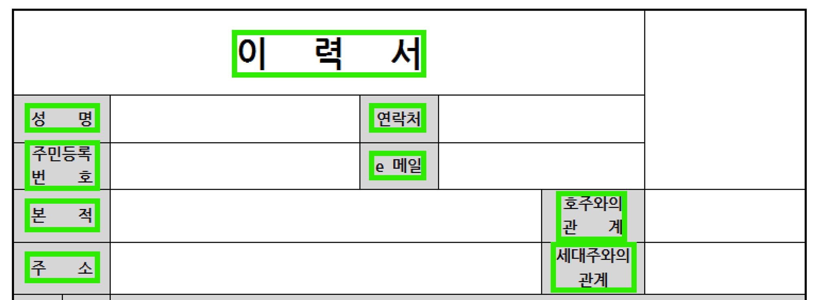

재직중인 회사에서 서비스하는 제품 중 OCR을 이용해 문서 파일의 글자를 추출하고, 이를 기반으로 제목을 추정하는 기능이 포함 되어있다.

나는 감사하게도 NAVER CLOVA OCR과 서비스를 연동하고, 추출된 텍스트를 기반으로 문서 제목을 추정하는 기능 개발/개선에 참여했다.

## 제목 추출 알고리즘의 초기
 

기본적으로 이미지 혹은 PDF 파일을 OCR 처리를 하게 되면 위와 같이 글자로 인식한 부분에 대해서 Bounding Box로 인식된다. 

> **Bounding Box란?**  
> 한 이미지를 OCR 처리하면 결과로 단어 혹은 문장의 위치 기반의 좌표값이 나온다. 이 때 해당 좌표를 기반으로 사각형을 구성한 것을 Bouding Box 라고 칭한다.

처음에는 단순히가장 상단 그리고 중앙에 있는 Bounding Box 중 높이가 가장 큰 Bounding Box를 제목으로 선정했다. 개발 시에 정해진 문서 양식만 올라온다고 가정했기에, 이렇게 간단한 알고리즘을 구성해서 문제를 해결할 수 있었다.

하지만 요구사항과 '제목이 중앙에 오는 문서', '제목이 2줄인 문서', '소제목이 있는 문서' 등과 같이 업로드 되는 문서의 양식이 다양해지면서 기능 이슈에 대한 피드백이 있었다.

이전의 단순한 알고리즘으로는 모든 문서의 제목을 정확하게 추출하는 것은 힘들었다. 그리고 그것을 해결화는 과정에서 새로운 이슈도 발생했다.

### 이슈 1 : Bounding Box가 분리되어 나오는 현상

`NAVER CLOVA OCR` 을 통해 이미지 혹은 PDF 파일에 대해 OCR 처리를 하게 되면 하나의 문장에 대해 정확하게 OCR 되는 경우도 있지만, 하나의 문장이라도 여러 단어와 조사 등으로 나뉘어 OCR 되는 경우가 있었다. 

위 이미지의 경우, `안전 관리 실무자 선임 문서` 가 제목이지만, 초기의 단순한 알고리즘을 통해 제목을 추출하면 `안전 관리` 혹은 `실무자 선임 문서` 중 하나만 제목으로 채택된다. 그래서 만약 Bounding Box가 분리되어 온다면 한 문장인 경우 서로 병합하여 계산할 필요가 있었다.

#### 인접한 Bounding Box 병합하기

앞서 이야기 했듯이 OCR 결과는 Bounding Box로 주어진다. 그리고 그 Box에는 `좌・상단`, `좌・하단`, `우・상단`, `우・하단` 좌표를 기반으로 만들어진다. 이 점을 이용하여 각 Box의 높이와 폭을 구할 수 있고, 이를 기반으로 인접한 다른 Bounding Box에 대한 거리 혹은 크기의 차이를 계산할 수 있다.

위 이미지를 기준으로 설명해보자면, `안전 관리` Box를 `Prev Box`라고 지칭하고, `실무자 선임 문서` Box 가 비교 대상이 된다. 이 둘을 같은 그룹으로 묶는 (같은 문장이라고 판단하는) 기준은 `안전 관리` Box에 대한 Width 및 Height를 기준으로 인접한 범위로 들 수 있는 범위를 정하고, 적절한 가중치를 더한다. 

쉽게 설명해보자면, 위 이미지에서 빨간색 영역은 `안전 관리` Box의 `Width 20%` 에 해당하는 영역이다. 그리고 해당 `안전 관리` Box의 범위를 끝에서 `빨간색 영역` 만큼 인접한 Bounding Box를 탐색한다. 여기서 노란색 박스가 실제 인접한 Bounding Box가 있는지 탐색하는 영역 범위이다. 

노란색 영역에 다른 Bounding Box가 있다면 그것은 서로 인접해있다는 의미이고, 같은 그룹 (같은 문장)으로 묶어도 된다는 의미이다.

결과적으로 `안전 관리` 와 `실무자 선임 문서` 2개의 Bounding Box를 하나로 합쳐 `안전 관리 실무자 선임 문서`의 Box를 새로 생성한다.

기존에는 위와 같은 문서 제목을 `안전보건교육일지 결 작성 검 토 승 인` 으로 인식되었다. 하지만 해당 병합 방식을 적용하고나서는 `안전보건교육일지` 로 정확하게 인식되었다. 

결국 이러한 병합 방식에서 중요한 것은 인접한 `Bounding Box` 를 탐색하는 범위를 어느 정도로 할 것이냐가 제일 중요하다.

이 부분에 대해서 `Silver Bullet` 은 찾을 수 없다. 문서 크기에 대해서도 고려해야 하고, 길이와 높이에 대해서도 고려해보아야 한다. 결국 여러 가지 문서를 받아보고, 추출하면서 가중치를 조절하면서 통상적으로 많은 문서를 처리할 수 있는 가중치를 찾아야 한다.

실제로 해당 기능을 고도화 하기 위해 긴 시간을 들여 가중치를 조절하며 최적의 값을 찾아나갔다. 

추가적으로 여러 줄에 걸쳐 구성된 제목의 문서도 X좌표 상에서 인접한 Bounding Box를 찾는 것처럼 Y좌표 상에서 인접한 Bounding Box를 탐색하는 방법으로 여러 줄에 걸친 제목을 병합할 수 있었다.

### 이슈 2 : 제목 후보 별 점수 스코어링

두 번째 문제는 바로 문서의 제목이 바로 다양한 위치에 있을 수 있다는 것이었다. 

`PPT` 기반으로 작성한 문서의 경우 제목은 중간에 위치해있고, `Word`, `Hwp` 를 통해 작성한 문서는 대부분 상단 중앙에 위치해있다. 

이런 모든 케이스를 고려하여 애플리케이션 로직으로만 해결하는 것은 매우 해결하기 어려웠다. 그래서 여러가지 요소들을 종합해서 문장 후보를 선별하고, 그 기준을 통해 점수를 도입하기로 했다.

각각 평가하고자 하는 요소들은 다음과 같다.
- **위치**
- **크기**
- **길이**

각 세부 요소에 대해서 어떤식으로 기준을 잡았는지에 대해서는 이야기 할 수 없지만, 각각의 문장들을 위치, 크기, 길이에 대해서 제목과 유사한 특징을 가질 수록 높은 점수를 주고 가장 점수가 높은 문장을 제목으로 선정하는 방식이다.

좀 더 설명해보자면, 3가지의 `위치`, `크기`, `길이` 중 제목으로서 가장 중요하게 평가하는 항목이 있고, 가장 덜 중요한 항목이 있다. 

예를 들어 문서 하단에 제목이 위치하는 문서라고 가정해보자. 만약 위치에 대해 중앙 상단을 중점으로 문서의 제목을 결정한다면 실제 제목이 하단에 존재하더라도, 부가 정보를 중앙 상단에 적어놓았더라면 부가 정보가 제목으로 선정된다. 

이는 잘못된 방식이다. 

이런 케이스를 고려하기 위해서 각 항목마다 적절한 가중 점수를 부여하고, 각 특징에 대해서 점수를 부여하는 방법이다. 중요한 것은 각각의 가중치이라고 할 수 있다. 이는 내부에 정해진 문서 데이터를 기반으로 결정했다.

### 결과
두 가지 이슈를 해결하니, 기존에 준비한 수많은 테스트 문서에 대해 대부분 정확히 제목을 인식할 수 있었다. OCR 상에서 정확하게 특정할 수 없는 `특수문자(./])` 에 대한 이슈가 살짝 있었지만

**대체적으로 성공적인 제목 추출을 보여줬고, 기존에 준비한 100여개의 테스트 문서 중 90% 이상의 제목 추출 정확도를 확인할 수 있었다.**

회사에서 진행한 프로젝트의 내용이기 때문에 상세한 내용은 이야기 못해서 아쉽지만, 처음에 한계라고 느꼈던 이슈를 긴 시간 동안의 점진적 개선을 통해 해결한 케이스이기 때문에 소중한 경험이라고 생각하고 있다.

추가적으로 LLM을 이용하면 더 정확한 제목을 추출할 수 있다.

그럼 초기부터 LLM을 쓰면 되지 않느냐 라고 생각할 수 있겠지만, 어떠한 기술이나 솔루션을 도입할 때 `Trade Off` 를 항상 생각해봐야 한다. 

서비스 기획 및 개발 초기 당시, LLM을 활용한 제목 추정 기능은 벤처성으로 기획된 프로젝트이기 때문에 계획되지 않았지만, 이후 챗봇 개발 기획 등을 통해 도입할 수 있었다.

또한 LLM은 Token을 기반으로 비용을 책정하기 때문에, 위 알고리즘을 통해 LLM에 넘기는 파라미터의 Token 수를 줄여 비용 절감을 할 수 있다는 장점으로 이어진다. 

기능이 들어간 서비스의 제목 추출 기능은 현재도 문제 없이 잘 돌아가고 있다. 😀