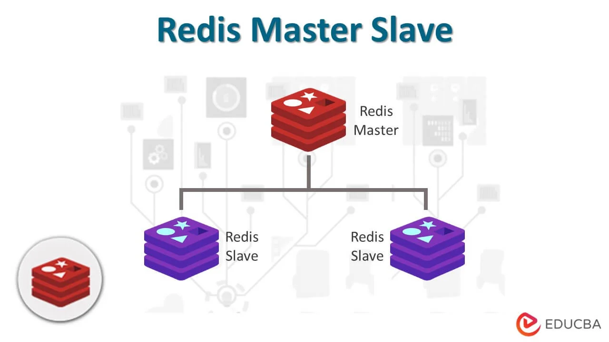
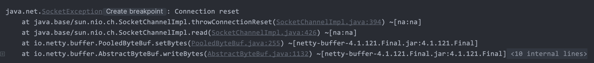
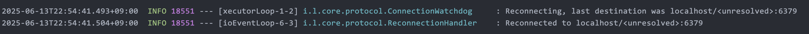
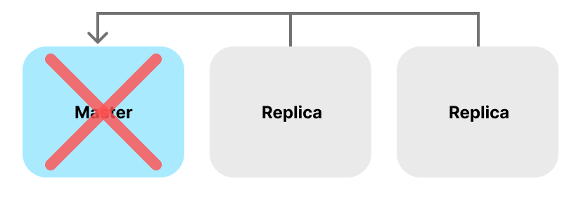
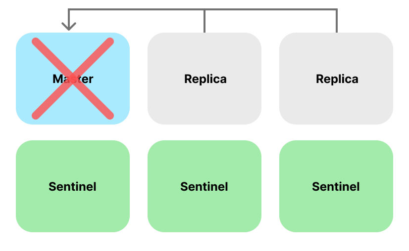
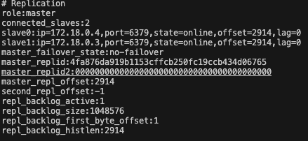
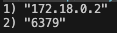
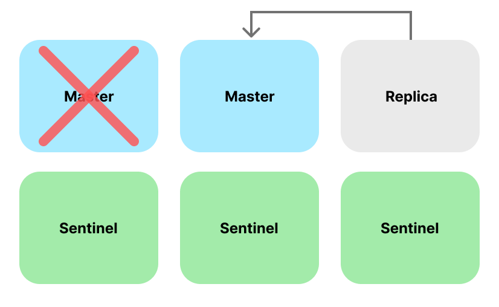
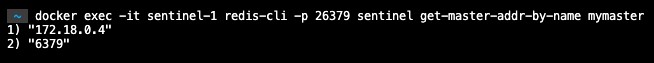

`Redis Sentinel` 은 `Redis` 의 **고가용성 (High Availabiliity)**를 보장하기 위한 시스템입니다.

많은 요청을 처리해야 하는 서비스에서 만약 한 대의 Redis만 사용한다면 과도한 부하로 인해 장애가 발생했을 때, Redis에 의존하는 서비스들은 정상적으로 운영하기 어렵고, 성능이 대폭 감소할 수 있습니다. 

> **고가용성이란?<br>**
> 고가용성 (HA, High Availability) 란? 쉽게 말해서 어떠한 서버나 시스템이 오랫 동안 정상 운영이 가능한 정도를 이야기 합니다. 장애가 발생하더라도, 이를 빠른 시간 안에 복구하고, 정상적인 서비스를 운영하여 서비스 신뢰성을 복구한다면 고가용성이 높다라고 말할 수 있습니다.
> 
> 고가용성을 높이는 방법과 전략에는 여러가지가 있지만, 본 포스트에서는 `Redis-Sentinel` 을 중심적으로 설명하겠습니다.

## Redis-Sentinel
---
Redis Sentinel 은 앞서 말했듯이 Redis의 고가용성을 보장하기 위한 시스템입니다. 분산 환경에서는 Redis가 여러 노드에 걸쳐 동작됩니다. 모니터링을 통해 `master` 및 `replica` 가 정상적으로 동작하는지 확인하고, 자동으로 장애를 복구할 수 있는 기능을 제공합니다.

보통의 Sentinel은 3개 이상의 인스턴스를 구성합니다. 이렇게 구성하면 합의를 통해 장애 여부를 판단할 수 있어 더욱 더 안정적인 시스템을 구성할 수 있습니다.

### 주요 개념
---
**Quorum** <br>
Quorum(합의) 이란 각각의 Sentinel 들이 master 가 죽었다고 판단할 때 `필요한 최소한의 합의 수` 입니다.
만약 `Quorum = 3` 이라면, 최소 3개의 Sentinel 이 `master` 가 죽었다고 판단해야 장애 복구가 시작 됩니다.

**Failover** <br>
Failover 란 시스템에 한 구성 요소에 장애가 발생했을 때, 즉시 다른 예비 시스템으로 대체하여 서비스를 계속해서 지속하는 기능입니다. Redis Sentinel 에서는 master 에 장애가 발생하였을 때, 여러 replica 인스턴스 중 1개를 master를 승격 시키는 것을 의미합니다.

### What is Sentinel?
---
1개의 Redis 인스턴스만을 사용한다면, 해당 Redis에 부하가 생겨 장애가 발생했을 때, Redis에 의존하는 서비스들은 정상적으로 운영하기 어렵고, 성능이 대폭 감소할 우려가 있습니다. 



이를 해결하기 `Master-Replica` 구조로 Redis 환경을 구성하는데요, 이는 `Master Redis Instance` 를 통해 데이터를 쓰고, 다수의 `Replica Redis 인스턴스`에서 데이터를 읽는 구조인 것 입니다. 상대적으로 읽기 처리를 해야 하는 서비스가 많기 때문에 읽기 전용 `Replica Redis 인스턴스` 를 늘리는 구조입니다.

데이터가 여러 인스턴스에 복제되어 있어, 읽기 요청 처리를 분산 시킬 수 있어 부하를 줄일 수 있다는 장점이 있습니다.

그런데 만약 이러한 구조에서 `Master Redis Instance` 에 문제가 생기면 어떻게 될까요?



Application 운영 도중 `Master Redis Instance` 에 장에가 발생하면 위와 같이 Connection 끊깁니다.



이후, `Master Redis Instance` 가 정상적으로 동적하게 되면 재연결하여 이전처럼 정상적으로 Redis를 사용할 수 있게됩니다. 

하지만 이렇게 `Master Redis Instance` 에 장애가 생기면 사람이 직접 장애를 복구해야 하고, 이로 인해 긴 시간 동안 Redis를 사용 하지 못하면서 DB에 부하가 생겨 **전체 시스템에 장애가 전파될 수도 있습니다. **



하지만 여전히 `Replica` 는 정상적으로 운영이 가능합니다. `Redis-Sentinel` 은 바로 이 여분의 Replica를 Master로 승격시켜, 장애를 복구하는 시스템을 의미합니다. 

하지만 `Master Redis Instance` 에 장애가 발생했다고 어떻게 판단할까요? 그것을 판단하는 것이 바로 `Sentinel` 이란 존재입니다.


### Sentinel의 역할
---
- `모니터링`
- `자동 장애 조치`
- `알림`

`Sentinel` 은 대략적으로 위와 같은 역할을 합니다. 

`Master Instance`와 `Replica Instance` 를 주기적으로 모니터링하여 장애가 발생했는지 확인합니다. 

이에 `Master Redis Instance` 가 응답하지 않으면 `주관적 다운` 상태로 판단합니다. 
또한 `Master Redis Instance` 가 여러 `Sentinel` 등에 다운됐다고 판단되면 `Quorum` 을 통해 `객관적 다운` 상태로 판단하여, 여러 `Replica` 중 하나를 `Master` 로 승격합니다. 

그리고 나머지 `Replica` 들은 새롭게 승격된 `Master` 를 바라보게 만듭니다. 이 외에도 장애 및 복구와 같은 이벤트가 있을 때, 사용자가 설정한 것을 토대로 알림을 전송해주기도 합니다.

### 몇 대의 Sentinel이 필요할까?
앞서, `Sentinel` 은 여러 `Sentinel` 들에 의해 `Master` 가 다운된 것을 합의한다고 했습니다. 
하지만 `단일 Sentinel` 을 운용하고 만약 그 `Sentinel` 에 네트워크 문제가 발생했다면
이를 `Master`의 주관적 다운이라고 판단하고 이는 `단일 Sentinel` 이기 때문에 객관적 다운으로 이어집니다. 

그렇게 되면 실제로 장애가 발생하지 않았는데도, `Replica`를 `Master`로 승격시켜버리는 문제가 발생합니다. 이에 Sentinel 은 `최소 3대` 가 존재해야 이를 객관적으로 `Master` 가 다운됐다고 판단할 수 있기에 과반이 형성될 수 있는 `최소 3대의 Sentinel` 을 운용해야 효과적으로 자동 장애 복구 및 감지 기능을 발휘할 수 있습니다.


## 구현해보기

간단하게 Docker를 통해 구현해보도록 하겠습니다. 총 6개의 컨테이너의 분류는 다음과 같습니다.

- `redis-master`
- `redis-replica-1`
- `redis-replica-2`
- `redis-sentinel-1`
- `redis-sentinel-2`
- `redis-sentinel-3`

먼저 `redis-master` 를 올려주도록 하겠습니다.

```shell
docker run -d --name redis-master --network {NETWORK_NAME} -p {PORT}:6379 redis:{TAG} redis-server --apendonly yes
```

- `--appendonly` : 데이터를 영구적으로 저장하기 위한 옵션입니다. `appendonly.aof` 파일에 기록하고 서버 재시작 시 해당 내용을 기반으로 데이터를 복원합니다.

다음은 `redis-replica-n` 입니다.

```shell
docker run -d --name redis-replica-n --network {NETWORK_NAME} -p {PORT}:6379 redis:latest redis-server --slaveof redis-master 6379
```

- `--slaveof` : 호스트가 `redis-master` 이고 포트가 `6379` 인 마스터를 따른다는 옵션입니다. 즉 해당 Master의 Replica로 설정됩니다.

원하는 개수의 `Replica` 만큼 생성하면 됩니다.

이제 마지막으로 `redis-sentinel`을 생성할 차례입니다.

```shell
docker run -d \
--name sentinel-1 \
--network {NETWORK_NAME} \
-p {PORT}:26379 \
-v $(pwd)/sentinel.conf:/etc/sentinel/sentinel.conf \
redis:latest \
sh -c "sleep 5 && redis-sentinel /etc/sentinel/sentinel.conf"
```

Sentinel의 경우 옵션을 넣는 파일을 Volume을 잡았다. 이에 `sentinel.conf` 내용은 다음과 같습니다.

```conf
sentinel monitor mymaster {MASTER_IP} 6379 2
sentinel down-after-milliseconds mymaster 5000
sentinel failover-timeout mymaster 10000
# sentinel auth-pass mymaster {MASTER_PASS}
```

- `monitor mymaster redis-master 6379 2` : 내부에서 mymaster 라는 이름으로 redis-master:6379 라는 master를 모니터링 하고, `최소 2개의 Sentinel` 이 `Master` 가 다운되었다고 판단해야 `Failover` 를 수행한다는 설정입니다.
- `down-after-milliseconds mymaster 5000` : Master가 5(5000ms)초 동안 응답이 없으면 다운된 것으로 판단합니다. (주관적 판단)
- `failover-timeout mymaster 10000` : Failover 시 전체 프로세스에 적용될 Timeout의 설정값 (새 마스터 승격, 클러스터 재구성 등등)
- `auth-pass mymaster {PASSWORD}` : Master 생성 시 `Pass`를 설정했다면 기록되는 값

위 과정을 따랐다면, 총 `6개의 컨테이너`가 성공적으로 동작할 것 입니다.. 이제 Master가 다운되었을 때, 각각의 Sentinel 들이 합의를 통해 Replica 중 하나를 Master로 승격하는지 확인하는 과정이 남았습니다.

## 확인하기

먼저 `redis-master` 와 `redis-replica-n` 잘 연결되어있는지 확인해봅니다.

```shell
docker exec -it redis-master redis-cli info replication
```



해당 명령어를 통해 `Master Redis Instance` 와 연결된 `Replication Redis Instance` 들의 정보를 확인할 수 있습니다.

그리고 Sentinel 목록 중 하나의 컨테이너에서 마스터를 잘 바라보고 있는지 확인합니다.

```shell
docker exec -it sentinel-n redis-cli -p {PORT} sentinel get-master-addr-by-name {MASTER_NAME}
```



 이제 Master를 다운 시켜서 각각의 Sentinel 들의 합의를 통해 Replica 중 하나를 Master 로 승격시키는 지 확인해봅시다. `Master` 를 다운 시키기 위해서 `redis-master` 컨테이너를 정지 시켜 봅시다.

```shell
docker stop redis-master
```

그리고 여러 `Sentinel 컨테이너` 중 하나의 로그를 살펴봅니다.

```shell
docker logs -f sentinel-1
```

```
10:X 16 Jun 2025 06:52:14.841 # +vote-for-leader c193c15f0a95f7b655f6ab0225f0042a958d11e1 1
10:X 16 Jun 2025 06:52:15.785 # +odown master mymaster 172.18.0.2 6379 #quorum 3/2
10:X 16 Jun 2025 06:52:15.785 * Next failover delay: I will not start a failover before Mon Jun 16 06:52:35 2025
10:X 16 Jun 2025 06:52:16.014 # +config-update-from sentinel c193c15f0a95f7b655f6ab0225f0042a958d11e1 172.18.0.5 26379 @ mymaster 172.18.0.2 6379
10:X 16 Jun 2025 06:52:16.014 # +switch-master mymaster 172.18.0.2 6379 172.18.0.4 6379
```

`redis-master` 컨테이너를 중지시키게 되면, 각각의 `Sentinel` 이 투표를 통해 `redis-master` 가 다운됐다는 것을 공식적으로 확인합니다. 그리고 투표의 값이 우리가 [설정한 임계값]() 을 넘어가게 되면, (로그에서는 3/2로 과반을 넘었다.) `Replica Redis Instance` 중 하나를 `Master Redis Instance` 로 승격시킵니다.


승격이 완료된 뒤에 `Sentinel` 에서 다음 명령어를 통해 바라보고 있는 Master 를 확인할 수 있습니다.

```shell
redis-cli > SENTINEL get-master-addr-by-name {모니터링_하고_있는_Master_이름}
```

다음과 같이 다른 `Replica Redis Instance` 의 주소가 저장되어 있는 것을 확인할 수 있습니다.



정확히 확인하기 위해서, 새롭게 승격된 `Master Redis Instance` 에 접속하여 `info replication` 명령어를 확인하면 `role:master` 임을 확인할 수 있습니다.



그리고 이전에 중지된 `redis-master` 를 정상적으로 복구 시키게 되면 현재 `Master Redis Instance` 의 `Replica`로 붙게 됩니다.

자세한 코드 내용은 [블로그 코드 저장소](https://github.com/jin-daram/tech-blog-code-lab) 에서 내용을 확인하실 수 있습니다.

## 마무리

이렇게 `Redis Sentinel` 에 대해 알아보고, 직접 테스트하여 `Quorum`, `Failover` 의 처리를 눈으로 확인해보았습니다. 학습하면서 알게 된 사실인데, Master-Replica 구조로 Redis를 구성했을 때, 읽기 요청 시 자동으로 로드밸런싱을 해주는 것이 아니더군요. *( `Lettuce`와 같은 Redis Client 에서도 지원을 안하는 것 같았습니다. )*


그래서 [Twemproxy](https://github.com/twitter/twemproxy) 나 [Predixy](https://github.com/joyieldInc/predixy) 와 같은 프록시를 거쳐야 한다는 것을 알았습니다. [참조](https://github.com/redis/lettuce/issues/834) 

> Lettuce selects a slave per slot hash and uses the selected slave for read operations until the next topology refresh. This is by design to reduce CPU overhead.

이를 통해 Redis의 구성이 변경되지 않는 한 *(e.g 새로운 Replica Redis가 추가된다거나 등)* 지정된 Replica에 대해서만 읽기 요청을 보낸다는 것 같았습니다.

사실 이러한 설정은 굉장히 복잡하고, 네트워크도 설정해야 하니, 수지타산을 고려하여 이런 것들을 상대적으로 쉽게 설정할 수 있는 `AWS ElastiCache` 와 같은 서비스를 이용하는 것도 좋을 것 같습니다.
